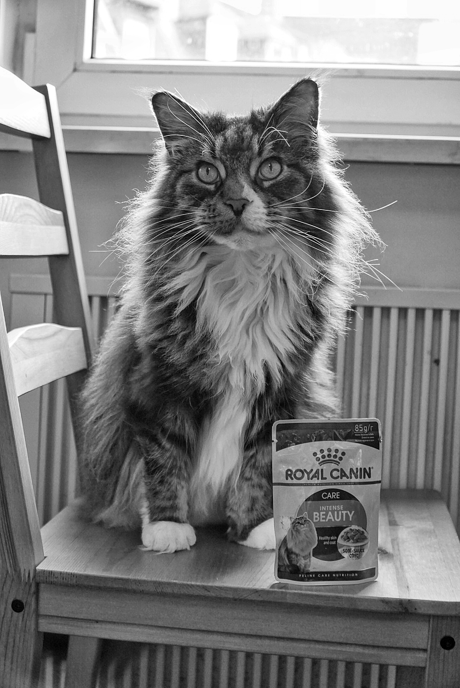

---
authors:
- Matthew G. Blango
bio: Matt was a postdoctoral fellow and small group leader at the Leibniz-HKI in Jena, Germany with Prof. Axel Brakhage studying fungal biology and pathogenesis. His work centered on the conidial (spore) surface proteome, the extracellular vesicle biology of host-pathogenesis, and the importance of non-coding RNA in fungi. He earned his PhD in Microbiology and Immunology studying the pathogenesis and biochemistry of uropathogenic Escherichia coli with Prof. Matt Mulvey at the University of Utah. He followed his PhD with a postdoctoral fellowship also at the University of Utah defining the endogenous pool of double-stranded RNA in mammalian immune cells with Prof. Brenda Bass. 
email: "matthew.blango@leibniz-hki.de"
interests:
- Fungi
- RNA Biology
- Host Pathogenesis
organizations:
- name: Leibniz Institute for Natural Product Research and Infection Biology (Leibniz-HKI)
  url: "https://www.leibniz-hki.de/en/home.html"
role: Junior Research Group Leader
social:
- icon: envelope
  icon_pack: fas
  link: '#contact'
- icon: twitter
  icon_pack: fab
  link: https://twitter.com/mgblango
- icon: google-scholar
  icon_pack: ai
  link: https://scholar.google.com/citations?user=2ZXBIEYAAAAJ&hl=en
- icon: orcid
  icon_pack: ai
  link: https://orcid.org/0000-0001-8015-9019
- icon: github
  icon_pack: fab
  link: https://github.com/alkalifire
- icon: address-card
  icon_pack: fas
  link: https://mgblango.netlify.app/
superuser: true
title: "Matthew G. Blango"
user_groups:
- Principal Investigator
---
### **Learn More**

Matt was a postdoctoral fellow and small group leader at the [Leibniz-HKI](https://www.leibniz-hki.de/en/home.html) in Jena, Germany with Prof. [Axel Brakhage](https://www.leibniz-hki.de/en/mam-head.html) studying fungal biology and pathogenesis. His work centered on the conidial (spore) surface proteome, the extracellular vesicle biology of host-pathogenesis, and the importance of non-coding RNA in fungi. He earned his PhD in Microbiology and Immunology studying the pathogenesis and biochemistry of uropathogenic *Escherichia coli* with Prof. [Matt Mulvey](https://bioscience.utah.edu/faculty/mulvey/mulvey.php) at the University of Utah. He followed his PhD with a postdoctoral fellowship also at the [University of Utah](https://www.utah.edu/) defining the endogenous pool of double-stranded RNA in mammalian immune cells with Prof. [Brenda Bass](https://biochem.utah.edu/bass/).

Here is Matt's up-to-date [CV](https://mgblango.netlify.app/files/cv.pdf)

When not in the lab, Matt enjoys outdoor adventures, photography, and hanging out with his wife and cat. 

