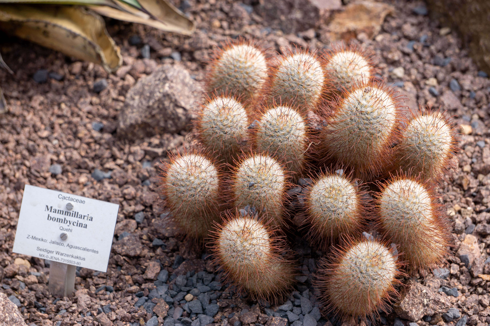
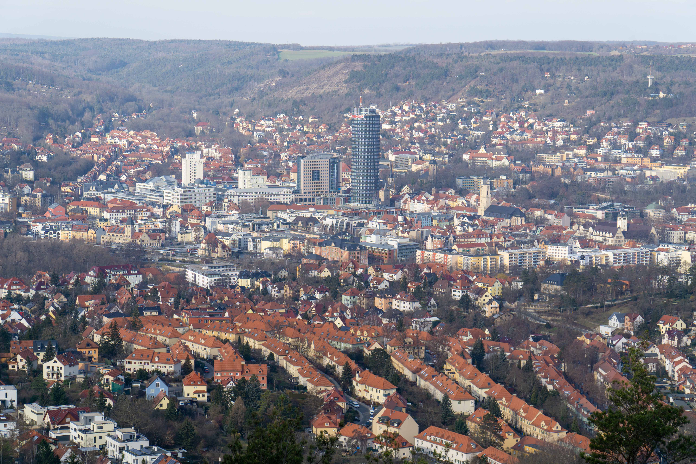

[Jena](https://en.wikipedia.org/wiki/Jena) was first mentioned in 1182 and remained a small town for a long while. When you visit today, Jena is a bustling university town in the heart of the German state of Thuringia. 

The city has approximately 110,000 residents, and has a vibrant student population. The [Friedrich-Schiller-Universität Jena](https://www.uni-jena.de/en) and the [Ernst-Abbe-Hochschule Jena](https://www.eah-jena.de/de-de) keep most of the students busy. The [Beutenberg Campus](https://www.beutenberg.de/en/home/) brings together a variety of research institutes and companies around Jena. 

If life brings you to Jena, you should be sure to check out the [Botanical Garden](https://en.wikipedia.org/wiki/Botanischer_Garten_Jena) and the [Zeiss-Planetarium](https://en.wikipedia.org/wiki/Planetarium_Jena)!

You can find additional must-see attractions on the [Visit-Jena](https://www.visit-jena.de/en/sights-experiences/jena-highlights/)  and [Visit-Thuringia](https://www.visit-thuringia.com/travel-hotel-holiday-tour/index.html) websites. 

## So what are you waiting for, get in touch!!

