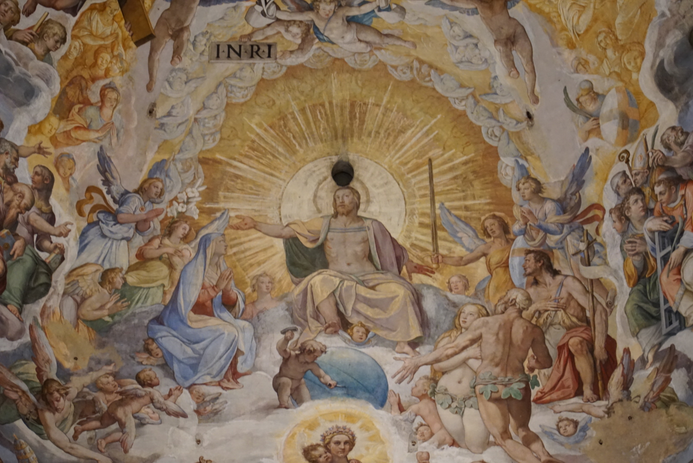
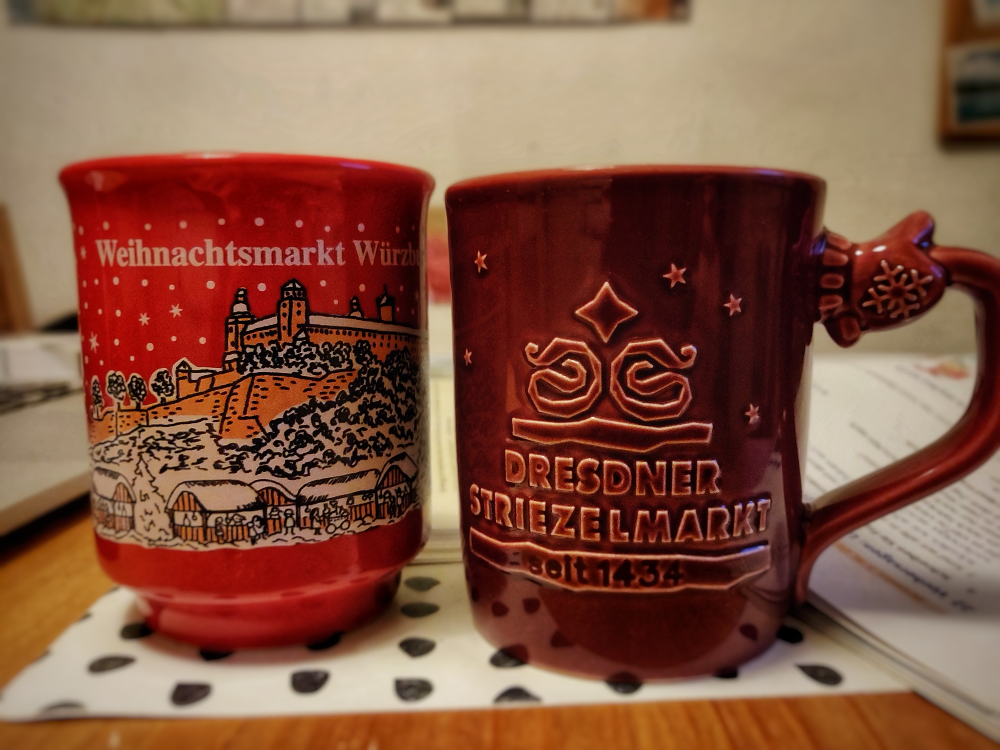
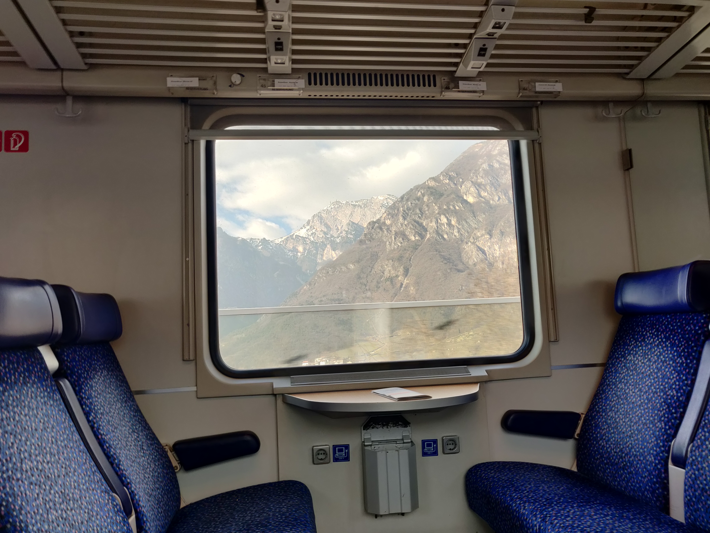
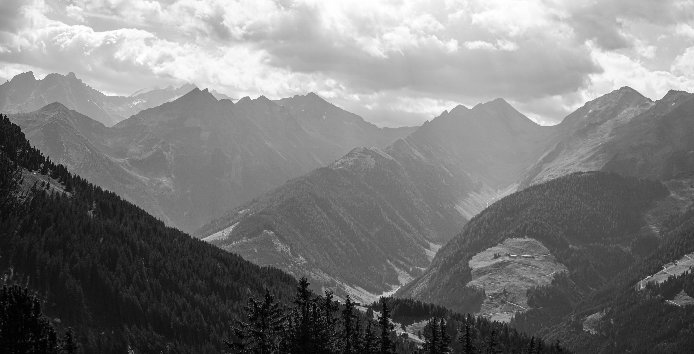
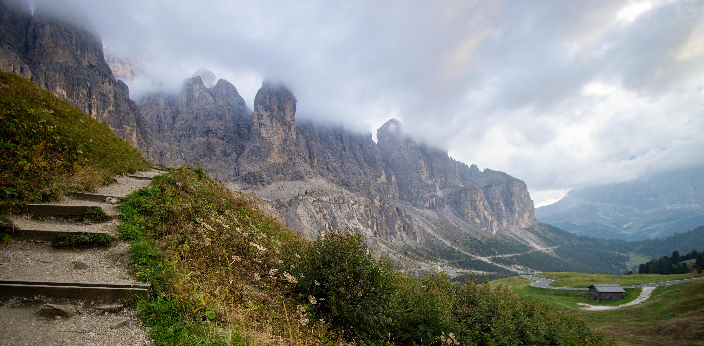
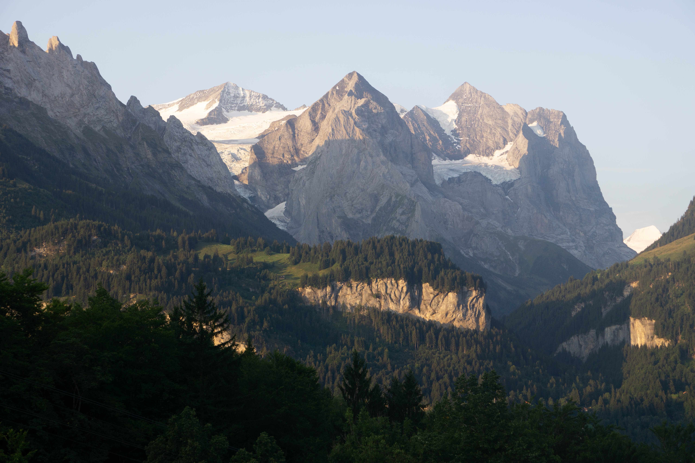

---
authors:
- admin
categories: []
date: "2020-10-02T00:00:00Z"
draft: false
featured: false
image:
  caption: "Image credit: [**Matthew G. Blango**]"
  focal_point: "center"
lastMod: "2020-10-02T00:00:00Z"
projects: []
subtitle: Hours away from some of the most amazing places on earth
summary: Jena offers easy access to a huge range of history and outdoors opportunities
tags: []
title: The Heart of Europe!
---

## Jena offers easy access to many central european highlights. 

You will be just hours from Berlin, Prague, Frankfurt, and Munich! The wonders of Italy, Spain, and France (and more) are just a short flight, or night train, away!

## Public transportation options abound!

The [DeutscheBahn](https://www.bahn.com/en/view/index.shtml) provides access by train to destinations across Germany and Europe!

## The Alps are only a few hours away and provide breathtaking beauty in all seasons!

Whether it is skiing in Switzerland, mountain biking in Austria, or climbing in Italy, the options for adventure are endless... 

While you are out exploring, don't forget to power up!

## Come for the sights, stay for the science!

